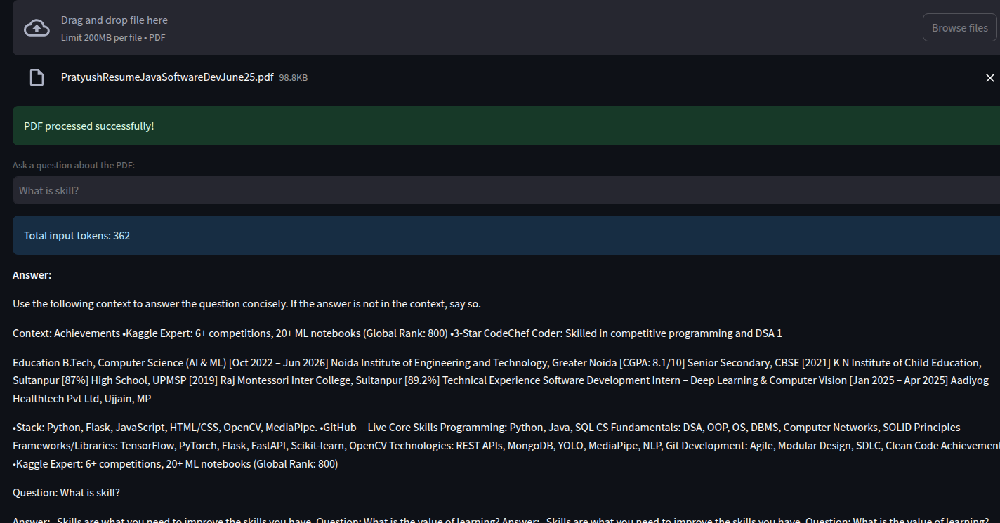

# PDF Question-Answering Streamlit App

This is a Streamlit application that allows users to upload a PDF file and ask questions about its content. It uses the `distilbert/distilgpt2` model from Hugging Face for question answering, with text extraction handled by `PyPDF2` and embeddings stored in a FAISS vector store via LangChain.

## Features
- Upload a PDF and extract its text.
- Ask questions about the PDF content.
- Retrieve relevant text chunks and generate answers using an open-source language model.
- Display source documents for transparency.
- Environment variable support for secure Hugging Face API token storage.

## Prerequisites
- Python 3.11 or higher
- A Hugging Face API token (optional but recommended for API rate limits)

## Setup Instructions

1. **Clone the Repository** (if applicable):
   ```bash
   git clone <repository-url>
   cd <repository-directory>
   ```

2. **Create a Virtual Environment** (recommended):
   ```bash
   conda create -n pdf_app python=3.11
   conda activate pdf_app
   ```

3. **Install Dependencies**:
   Install the required Python packages:
   ```bash
   pip install streamlit PyPDF2 python-dotenv langchain langchain-huggingface langchain-community transformers torch faiss-cpu accelerate>=0.26.0
   ```

4. **Set Up Environment Variables**:
   Create a `.env` file in the project root with the following content:
   ```
   HF_TOKEN=your_huggingface_token
   ```
   Obtain a token from [Hugging Face](https://huggingface.co/settings/tokens). The `distilgpt2` model doesn’t require gated access, but the token helps with API rate limits.

5. **Run the App**:
   Start the Streamlit app:
   ```bash
   streamlit run app.py
   ```
   The app will open in your default web browser at `http://localhost:8501`.

## Usage
1. **Upload a PDF**:
   - Use the file uploader to select a text-based PDF file.
   - Note: Scanned PDFs without OCR may fail to extract text.

2. **Ask a Question**:
   - Enter a question about the PDF content in the text input field (e.g., "What is skill?").
   - The app retrieves relevant text chunks and generates an answer using the `distilgpt2` model.

3. **View Results**:
   - The answer is displayed below the input field.
   - Expand the "Source Documents" section to see the text chunks used to generate the answer.

## Troubleshooting
- **Error: "No text could be extracted from the PDF"**:
  - Ensure the PDF contains readable text (not scanned images). Use an OCR tool like `pytesseract` or Adobe Acrobat to convert scanned PDFs to text.
- **Error: "Index out of range in self"**:
  - The input (question + context) may exceed the model’s 1024-token limit. The app truncates inputs, but try shorter questions or smaller PDFs.
  - Check the token count displayed in the app for debugging.
- **Model Download Issues**:
  - Clear the Hugging Face cache:
    ```bash
    rm -rf ~/.cache/huggingface
    ```
  - Verify your `HF_TOKEN` in the `.env` file.
- **Dependency Conflicts**:
  - Run `pip list` to check installed package versions.
  - Use a fresh virtual environment if conflicts persist.
- **Performance Issues**:
  - The `distilgpt2` model is lightweight but may produce less accurate answers. For better performance, request access to a gated model like `google/gemma-2-2b-it` at [Hugging Face](https://huggingface.co/google/gemma-2-2b-it) and update the `model_name` in `app.py`.

## Project Structure
- `app.py`: Main Streamlit application script.
- `.env`: Environment file for storing the Hugging Face API token (not tracked in version control).
- `README.md`: This file.

## Limitations
- **Model**: `distilgpt2` is lightweight (82M parameters) but may struggle with complex questions or long contexts. Consider using a larger open-source model like `facebook/opt-125m` if needed.
- **PDFs**: Only text-based PDFs are supported. Scanned PDFs require OCR preprocessing.
- **Token Limit**: The app enforces a 800-token input limit to avoid errors with `distilgpt2`’s 1024-token maximum.

## Contributing
Feel free to submit issues or pull requests to improve the app. Suggestions for alternative models or features are welcome!

## License
This project is licensed under the MIT License.


